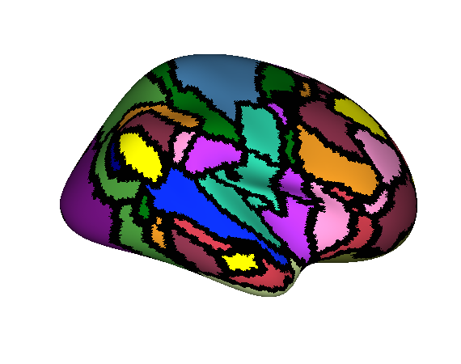
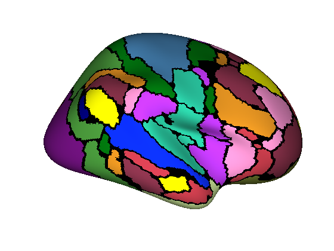
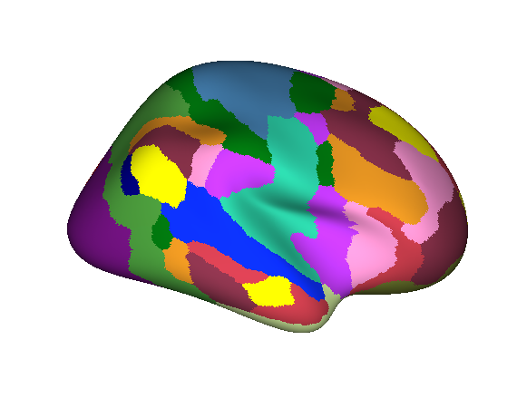

## dilateParcellation

A simple dilate parcellation function in MATLAB. Given a FreeSurfer annotation file with gaps, this function will fill these gaps with the most common local label value, based on values of the vertex neighborhood (you can set how large you would like this neighborhood to be). 

See ``example.m`` for an example of how to use this function. It should run with the example data provided.

This function is probably not elegantly efficient, however using the fsaverage surface it takes less than 10 seconds to dilate until there are no label gaps left.

This function was created after multiple Google'ing attempts resulted in me finding no such function to dilate a collection of labels (parcellation) on a FreeSurfer surface. Hopefully this helps all y'all!

### input parcellation

### dilation run two times

### dilation run until completion

 This material is based upon work supported by the National Science Foundation Graduate Research Fellowship under Grant No. 1342962. Any opinion, findings, and conclusions or recommendations expressed in this material are those of the authors(s) and do not necessarily reflect the views of the National Science Foundation. 

